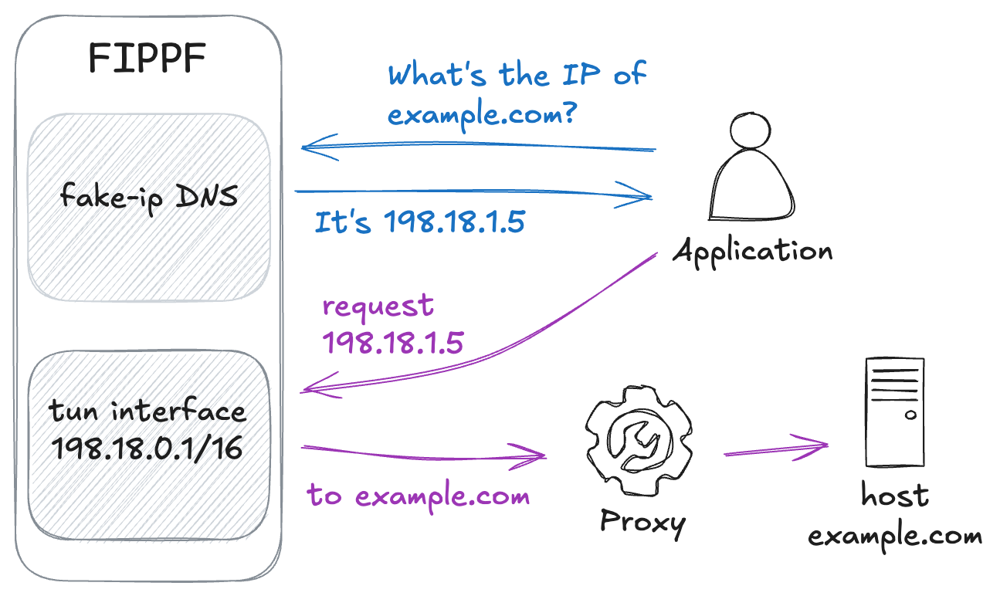

# FIPPF: a Fake-IP Proxy Frontend

_Comes with no warranty, use at your own risk._

FIPPF consists of a fake-IP DNS server and a tun network interface.
It resolves domain names to different fake IP addresses inside tun network's subnet,
and then forwards network requests to real hosts through proxy.

Called "frontend" because FIPPF itself does not provide proxy service,
it relies on a proxy "backend", like socks5, to do the actual proxying job.

Here is a diagram showing how FIPPF works:

## Goals and will not

FIPPF tries to achieve relatively high performance and low latency at DNS resolution and layer-4 traffic forwarding.
It is designed to be a stupid simple program for Linux with a small codebase.

## Try it out

For NixOS users, there is an accompanied [nix flake](https://github.com/Hyffer/fippf-nix) for easily integrating FIPPF into your system.

And there is a [systemd unit configuration file](https://gist.github.com/MirageTurtle/a5520c7a315ff193761367f50534b98a) for reference.
_(It is not maintained by author. Some of the content might be outdated, adjustments required.)_ 

### Build

Build the program with go (I use go1.23.1).

### Configure and Run

Example configurations are provided under directory [core](./core), refer to them for detail.

Launch the daemon by `fippf serve --config_dir /path/to/config`.

### Verify

Using curl with ares enabled (might need to build curl from source):

`curl --dns-servers 127.0.0.52 http://example.com`

or

Manually resolve the domain name first, let FIPPF map it to a fake IP address:

`dig @127.0.0.52 -p 53 example.com`

Then manually send request to that IP address:

`curl --resolve example.com:80:198.18.0.2 http://example.com`

The traffic should go through the proxy now.

### Debug / Inspection

FIPPF is shipped with a cli tool for inspecting what is going on inside,
e.g. `fippf status` to check for daemon running state.
Type `fippf -h` to see all available commands.

### Notice

Pointing system DNS resolver to FIPPF's fake-IP DNS server is allowed,
but take special care when FIPPF and proxy program are running on the same machine.
The proxy program cannot use system DNS resolver, otherwise it will cause a loop.

## Similar Projects

[rofl0r/proxychains-ng](https://github.com/rofl0r/proxychains-ng)
works as a dynamic library interceptor. FIPPF works as a kind of network gateway.

[Dante](https://www.inet.no/dante/):
ubuntu [dante-client package](https://launchpad.net/ubuntu/jammy/+package/dante-client) provides a "socksify" tool.
Like proxychains-ng, it is also an LD_PRELOAD based program.
socksify can proxy both TCP and UDP traffic, whereas proxychains-ng only supports TCP.

[xjasonlyu/tun2socks](https://github.com/xjasonlyu/tun2socks)
routes all traffic to tun interface. FIPPF leverages fake IP DNS and handles fake IP subnet only.

[nicocha30/ligolo-ng](https://github.com/nicocha30/ligolo-ng)
a lightweight VPN.

[SagerNet/sing-box](https://github.com/SagerNet/sing-box) and some clash like programs:
They can be configured to do pretty much the same thing as FIPPF, and even more.

## Acknowledgement

[google/gvisor](https://github.com/google/gvisor): FIPPF uses its tcpip library to handle network traffic conveniently.

[nicocha30/ligolo-ng](https://github.com/nicocha30/ligolo-ng): It is a really simple program with a small codebase
[(Jan 1 2025, commit ad07712)](https://github.com/nicocha30/ligolo-ng/tree/ad0771221693e9eb323620c532128cf1a3b68f6c).
Very nice for beginners.
